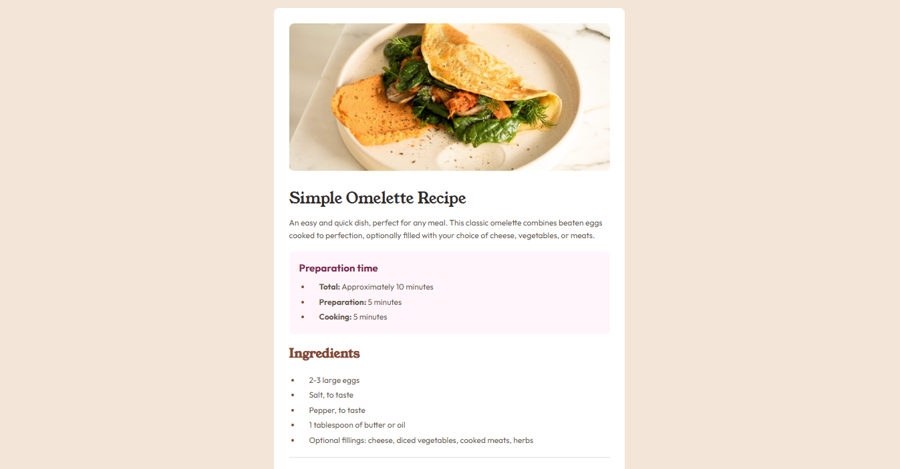

# Frontend Mentor - Recipe Page Main solution

This is a solution to the [Social links profile challenge on Frontend Mentor](https://www.frontendmentor.io/learning-paths/getting-started-on-frontend-mentor-XJhRWRREZd/steps/66ffdb3f5832c087f25bf3e6/challenge/start). Frontend Mentor challenges help you improve your coding skills by building realistic projects. 

## Table of contents

- [Overview](#overview)
  - [Screenshot](#screenshot)
  - [Links](#links)
- [My process](#my-process)
  - [Built with](#built-with)
  - [What I learned](#what-i-learned)
  - [Continued development](#continued-development)
- [Author](#author)

## Overview

### Screenshot

These are my screenshots showing how the project turned out.

- For desktop version:




- For mobile version:


### Links

- Solution URL: [My Solution](https://github.com/gillaercio/recipe-page-main)

## My process

### Built with

- Semantic HTML5 markup
- CSS custom properties
- Flexbox
- Mobile-first workflow

### What I learned

I took advantage of this project to practice the use of **Flexbox**:

```css
body {
  height: 100vh;
  display: flex;
  flex-direction: column;
  justify-content: space-evenly;
  align-items: center;
  align-content: space-around;
}
```

Of **pseudo-element**:

```css
main#content h2, main#content li::marker, main#content table tr td.right {
  color: var(--brown-800);
}
```

Of **@font-face**:

```css
@font-face {
  font-family: "YoungSerif";
  src:
    local("YoungSerif"),
    url("/assets/fonts/young-serif/YoungSerif-Regular.ttf") format("truetype");
}
```

And **@media-querie**:

```css
@media screen and (width > 768px) {
  main#content {
    width: 700px;
  }

  header {
    max-width: 700px;
  }

  header img {
    max-width: 640px;
  }

  main#content p, main#content ul, main#content ol, main#content table, footer.attribution {
    font-size: 1.6em;
  }

  main#content table tr td {
    width: 600px;
  }
}
```

### Continued development

I would like to improve the use of **Flexbox** in conjunction with media queries.

## Author

- Frontend Mentor - [@gillaercio](https://www.frontendmentor.io/profile/gillaercio)
- Github - [My Github](https://github.com/gillaercio)
- LinkedIn - [My LinkedIn](https://www.linkedin.com/in/gildman-la%C3%A9rcio/)

